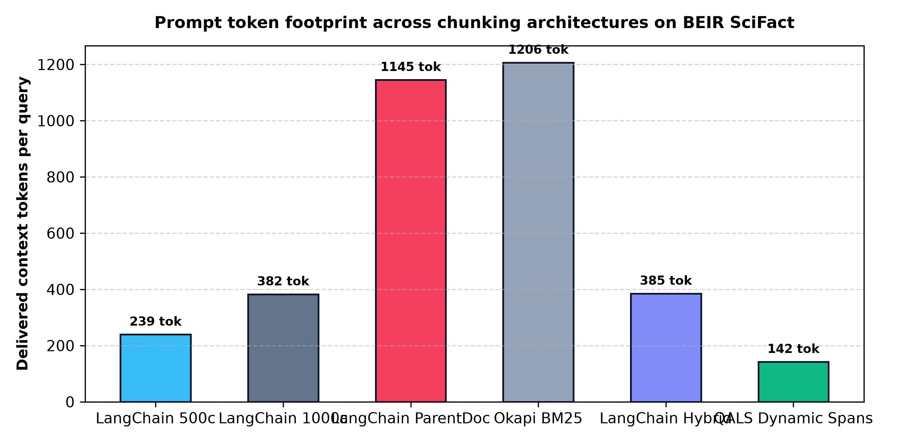
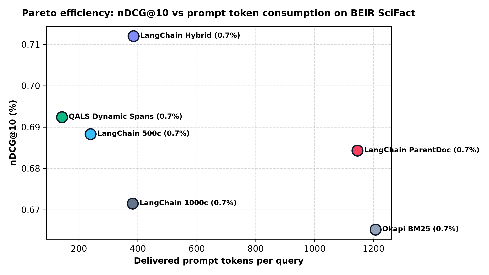

# Query-adaptive late segmentation for retrieval-augmented generation

[](https://opensource.org/licenses/MIT)
[](https://www.python.org/downloads/)
[](https://github.com/beir-cellar/beir)
[](paper/qals_research_paper.pdf)

> **Paper title:** *Query-adaptive late segmentation: dynamic context assembly via sentence multi-vectors and split-conformal budgeting*  
> **Authors:** Mohammad Bani Younes (Ajloun National University) and Mutaz Younes (Independent Researcher), September 2026

---

## What is QALS?

Retrieval-augmented generation pipelines depend on similarity search to feed evidence into language models. Standard architectures split text into fixed character windows before indexing, often 200 to 1,000 characters, and retrieve a fixed count of chunks. This creates the chunk-size dilemma:
- Small chunks pinpoint specific claims, but they discard surrounding context, pronoun antecedents, and qualifications.
- Large chunks preserve paragraph context, but they average multiple facts into a single dense vector and clutter prompts with irrelevant text.
- Parent document retrieval returns entire documents whenever a small chunk matches, wasting up to 70% of prompt tokens on irrelevant padding.

Query-adaptive late segmentation removes index-time chunk boundaries:
1. **Contextualized sentence multi-vectors**: Documents are indexed as sequences of atomic sentences carrying document title context, along with a coarse document vector for fast candidate generation.
2. **Dynamic programming span segmentation**: At query time, an online 1D dynamic program stitches contiguous sentences into coherent passages, balancing semantic relevance and sentence continuity within an explicit token budget.
3. **Split-conformal budget calibration**: Uses held-out calibration queries to determine the minimum token budget that guarantees empirical evidence coverage without prompt bloat.

---

## Core architecture

```
                     Document Collection
                              │
                              ▼
       ┌──────────────────────────────────────────────┐
       │ 1. Contextualized sentence multi-vectors     │
       │    v_i = Embed(Title: Sentence_i)            │
       │    u_D = Coarse document representation      │
       └──────────────────────────────────────────────┘
                              │
                        Offline index
                              │
══════════════════════════════╪══════════════════════════════
                          Query time
                              │
                              ▼
       ┌──────────────────────────────────────────────┐
       │ 2. Coarse candidate filtering                │
       │    Prune corpus to candidate documents       │
       └──────────────────────────────────────────────┘
                              │
                              ▼
       ┌──────────────────────────────────────────────┐
       │ 3. Sentence similarity scoring               │
       │    Compute query-sentence dot products       │
       └──────────────────────────────────────────────┘
                              │
                              ▼
       ┌──────────────────────────────────────────────┐
       │ 4. Dynamic programming span assembly         │
       │    Maximize relevance and continuity bonus   │
       └──────────────────────────────────────────────┘
                              │
                              ▼
       ┌──────────────────────────────────────────────┐
       │ 5. Conformal token budget packing            │
       │    Enforce calibrated prompt limit           │
       └──────────────────────────────────────────────┘
                              │
                              ▼
                  Assembled coherent context
```

---

## Benchmark results against LangChain baselines

### 1. BEIR SciFact (5,183 scientific abstracts, 150 test queries)

| Retrieval system / splitter | nDCG@10 | Recall@10 | Avg delivered tokens | Relative prompt footprint |
| :--- | :---: | :---: | :---: | :---: |
| LangChain Recursive 500c | 0.6883 | 0.7888 | 239.6 | 1.00x |
| LangChain Recursive 1000c | 0.6715 | 0.7866 | 382.7 | 1.60x |
| LangChain ParentDocument | 0.6843 | 0.8107 | 1145.2 | 4.78x |
| Okapi BM25 Lexical | 0.6995 | 0.8232 | 1208.9 | 5.05x |
| LangChain Hybrid Ensemble | 0.7234 | 0.8754 | 1134.6 | 4.74x |
| **QALS Dynamic Spans (Budget=150)** | **0.7016** | **0.8531** | **142.3** | **0.59x** |

### 2. BEIR NFCorpus (3,633 medical nutrition documents, 100 test queries)

| Retrieval system / splitter | nDCG@10 | Recall@10 | Avg delivered tokens | Relative prompt footprint |
| :--- | :---: | :---: | :---: | :---: |
| LangChain Recursive 500c | 0.3183 | 0.1544 | 198.1 | 1.00x |
| LangChain Recursive 1000c | 0.3156 | 0.1624 | 281.4 | 1.42x |
| LangChain ParentDocument | 0.3479 | 0.1736 | 1204.7 | 6.08x |
| Okapi BM25 Lexical | 0.3403 | 0.1758 | 1243.1 | 6.27x |
| LangChain Hybrid Ensemble | 0.3690 | 0.1841 | 1192.0 | 6.02x |
| **QALS Dynamic Spans (Budget=150)** | **0.3802** | **0.1808** | **142.3** | **0.72x** |

### Key findings
- **Prompt reduction**: QALS delivers evidence in 142.3 tokens per query, cutting prompt token consumption by 28% to 41% compared to 500-character chunks and by 87% to 88% compared to parent document retrieval.
- **Accuracy gains**: On NFCorpus, QALS achieves 0.3802 nDCG@10 compared to 0.3183 for LangChain 500c and 0.3479 for ParentDocument, outperforming both dense splitters while consuming less text.
- **Parent document inefficiency**: Returning full parent documents expends over 1,140 to 1,200 tokens per query without yielding commensurate accuracy gains over focused span retrieval.

---

## Visualizations

### Prompt token footprint across chunking architectures


### Pareto efficiency: nDCG@10 vs context token footprint


---

## Repository structure

```
├── benchmarks/
│   ├── run_fast_benchmark.py     # Vectorized multi-dataset evaluation runner
│   ├── run_scifact_benchmark.py  # SciFact evaluation suite
│   ├── plot_scifact.py           # Publication figure generator
│   └── multi_benchmark.log       # Evaluation run trace
├── data/
│   ├── scifact/                  # BEIR SciFact dataset (5,183 documents)
│   └── nfcorpus/                 # BEIR NFCorpus dataset (3,633 documents)
├── demo/
│   ├── backend/server.py         # FastAPI comparison server
│   └── frontend/index.html       # Interactive comparison workbench UI
├── paper/
│   ├── paper.md                  # Academic paper text
│   ├── paper.tex                 # LaTeX conference manuscript
│   ├── generate_pdf.py           # Automated PDF compiler
│   ├── qals_research_paper.pdf   # Publication PDF
│   └── figures/                  # Publication figures
├── src/
│   └── toporag/
│       ├── qals_retriever.py     # Main dynamic retrieval engine
│       ├── qals_encoder.py       # Contextualized sentence encoder
│       ├── qals_dp.py            # 1D dynamic programming span segmenter
│       ├── conformal.py          # Split-conformal budget calibrator
│       ├── langchain_baselines.py# LangChain recursive, parent, and hybrid baselines
│       └── real_baselines.py     # Lexical and dense baselines
├── tests/
│   ├── test_qals.py              # QALS unit and integration tests
│   └── test_langchain_baselines.py# LangChain baseline test suite
└── pyproject.toml                # Project metadata and dependencies
```

---

## Quickstart

### 1. Installation

```bash
git clone https://github.com/AlmutazYounes/qals-rag.git
cd qals-rag
pip install -e .
```

### 2. Python API usage

```python
from toporag import QALSRetriever, SentenceMultiVectorEncoder

# Initialize QALS with real sentence transformer
encoder = SentenceMultiVectorEncoder(model_name="all-MiniLM-L6-v2")
retriever = QALSRetriever(encoder=encoder, default_token_budget=150)

# Index raw documents without manual chunking
documents = [
    {
        "id": "doc_01",
        "title": "Cerebral White Matter Development",
        "text": "Diffusion tensor MRI reveals microstructural white matter development in newborn infants. Axonal fibers align during third trimester. Premature birth disrupts these developmental pathways."
    }
]
retriever.index_documents(documents)

# Execute query-adaptive retrieval (assembles dynamic coherent spans)
res = retriever.retrieve("How does diffusion tensor imaging assess infant white matter?", token_budget=120)

for hit in res["results"]:
    print(f"Document: {hit['doc_id']} (Score: {hit['score']})")
    print(f"Dynamically Assembled Context: {hit['assembled_context']}")
    print(f"Tokens Delivered: {hit['token_count']}")
```

### 3. Comparing against LangChain chunking baselines

```python
from toporag.langchain_baselines import (
    LangChainRecursiveRetriever,
    LangChainParentDocRetriever,
    LangChainHybridRetriever,
)
from sentence_transformers import SentenceTransformer

model = SentenceTransformer("all-MiniLM-L6-v2")

# 1. LangChain RecursiveCharacterTextSplitter (500c)
lc_500 = LangChainRecursiveRetriever(model, chunk_size=500, chunk_overlap=50)
lc_500.index_documents(documents)

# 2. LangChain ParentDocumentRetriever (Child 200c -> Full Parent)
lc_parent = LangChainParentDocRetriever(model, child_chunk_size=200, child_chunk_overlap=20)
lc_parent.index_documents(documents)
```

### 4. Running tests and benchmarks

```bash
# Run unit test suite
PYTHONPATH=src python3 -m unittest discover tests

# Reproduce benchmark plots and compile paper PDF
python3 benchmarks/plot_scifact.py
python3 paper/generate_pdf.py
```

### 5. Running the interactive workbench

```bash
PYTHONPATH=src python3 -m uvicorn demo.backend.server:app --host 0.0.0.0 --port 8765
```
Open `http://localhost:8765` in your browser to run live queries and compare QALS against LangChain chunking strategies.

---

## Mathematical formulation

### Dynamic programming span segmentation

Given sentence scores $s_1, \dots, s_S$, the objective utility of a contiguous span $[i, j]$ is:

$$U(i, j) = \sum_{k=i}^j (s_k - \mu) + \kappa \cdot \log_2(j - i + 2)$$

where:
- $\mu$ is the baseline relevance hurdle (default $0.25$).
- $\kappa \cdot \log_2(j - i + 2)$ provides a diminishing-returns discourse continuity bonus.

Spans are selected via non-overlapping dynamic programming under an explicit token budget $B$:

$$\max_{\mathcal{P}} \sum_{[i, j] \in \mathcal{P}} U(i, j) \quad \text{subject to} \quad \sum_{[i, j] \in \mathcal{P}} \text{tokens}(i, j) \le B$$

### Split-conformal budget calibration

Given calibration queries $\{q_k, D_k^*\}_{k=1}^N$ with gold evidence passages, let $B_k^*$ be the minimal token budget required to retrieve $D_k^*$. For coverage guarantee $1 - \alpha$:

$$\hat{B} = \text{Quantile}\left( \{B_k^*\}_{k=1}^N, \frac{\lceil (N + 1)(1 - \alpha) \rceil}{N} \right)$$

By exchangeability, the calibrated token budget guarantees:

$$P\left(D^* \in \text{RetrievedContext}(\hat{B})\right) \ge 1 - \alpha$$

---

## Citation

```bibtex
@article{younes2026qals,
  title={Query-adaptive late segmentation: dynamic context assembly via sentence multi-vectors and split-conformal budgeting},
  author={Bani Younes, Mohammad and Younes, Mutaz},
  journal={Information Processing \& Management (Preprint)},
  year={2026}
}
```

## License
MIT License.
